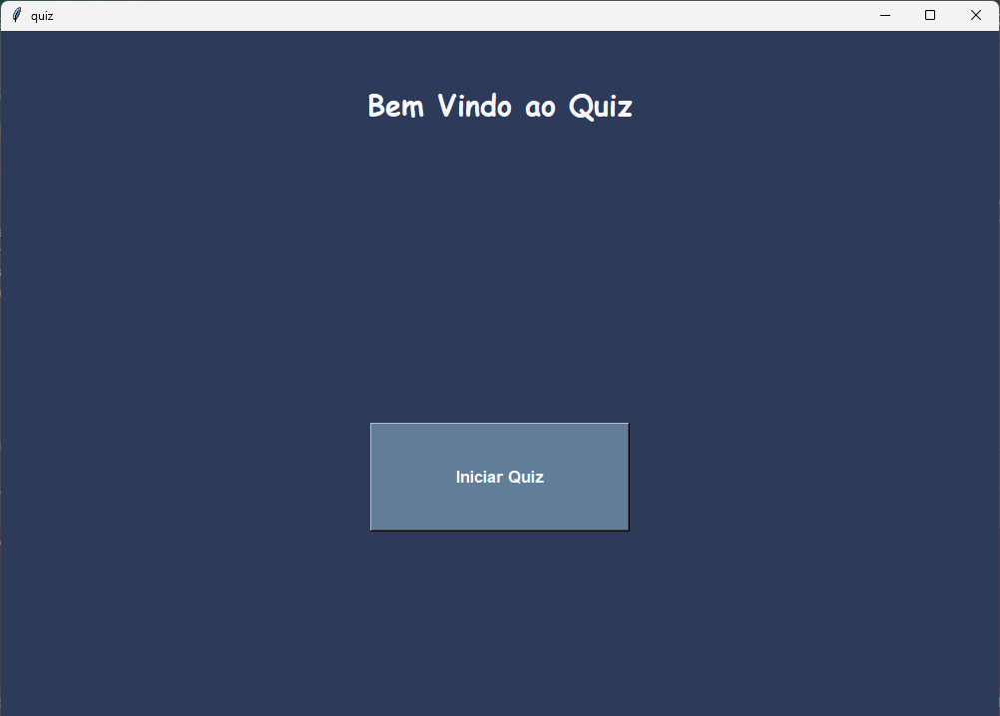
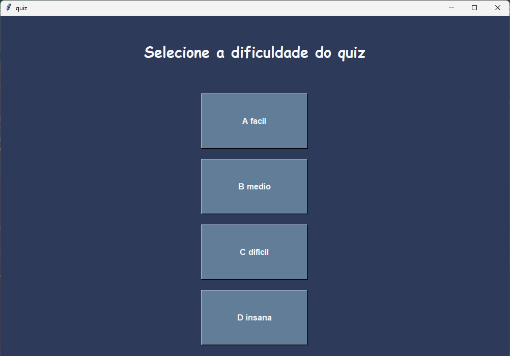
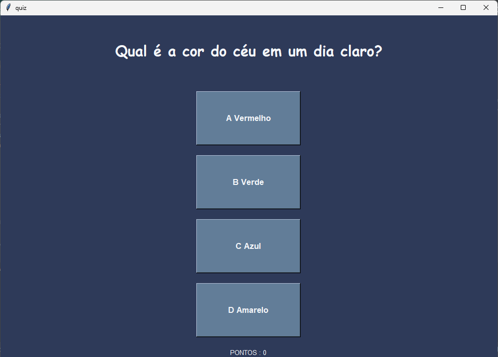
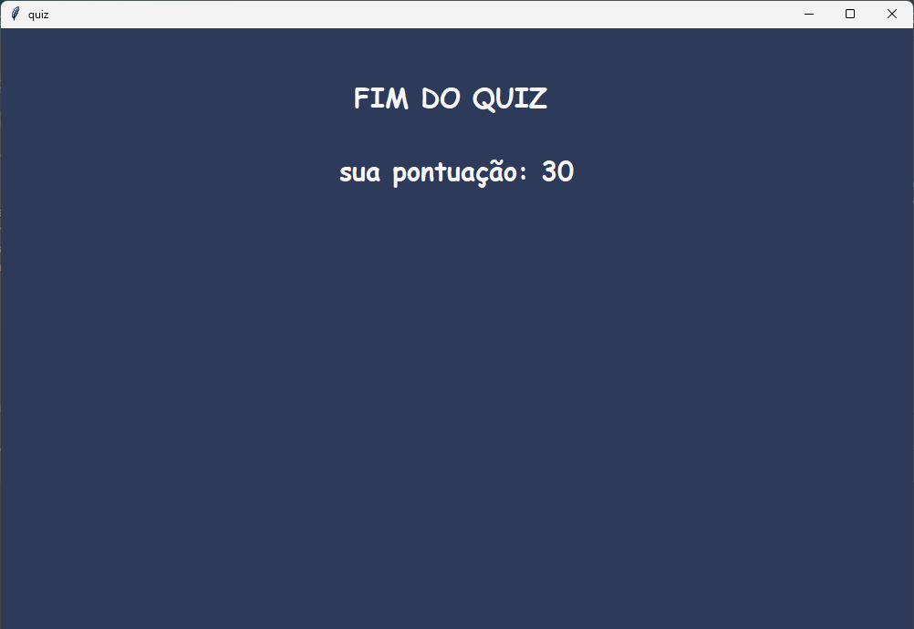

# -=-=- Quiz com Interface Gráfica -=-=-

--- Observações ---

- As dificuldades **Média**, **Difícil** e **Extrema** têm aproximadamente **30% de chance** de exibir uma pergunta de dificuldade inferior.
- A função **pontuacao** é responsável tanto por atualizar os pontos quanto por atualizar os textos da interface gráfica (GUI).
- as perguntas estão dentro do modulo **perguntas.json** para melhor legibilidade e organização.
- Cada quiz terá **10 perguntas**.
- O sistema de **leaderboard** ainda **não está pronto**, mas deve ser implementado em breve junto com uma tela inicial.

---

## Pontuação por Acerto
 Dificuldade | Pontos 

| Fácil  ----------------  +10    |

| Média  --------------  +15    |

| Difícil ---------------  +20    |

| Insana  --------------  +25    |

Caso deseje alterar os valores, modifique as **linha 145 a 156** do código principal.

---
## Telas do Quiz

### Tela Inicial


### Tela de Seleção de Perguntas


### Tela Durante o Quiz


### Tela Final


---

## Como Adicionar Perguntas

Para adicionar novas perguntas, siga **exatamente** os passos abaixo:

1. Vá até o módulo `perguntas_json`.
2. Dentro da lista correspondente (ex: `perguntas_F`, `perguntas_M`, etc), adicione um novo dicionário no seguinte formato:

```json
{
  "pergunta": "Qual é a capital do Brasil?",
  "certa": "Brasília",
  "erradas": ["Rio de Janeiro", "São Paulo", "Belo Horizonte"]
},
